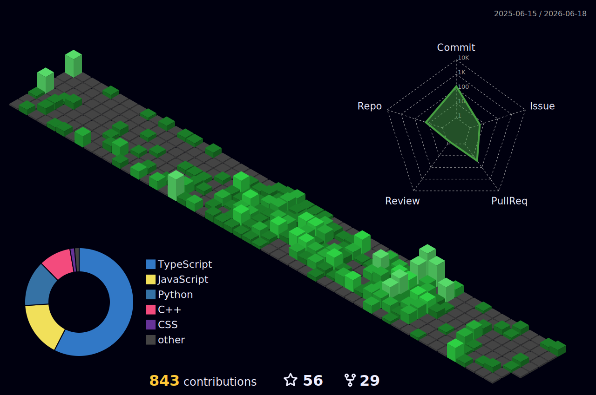

<h1 align="center">Hi 👋, I'm Ahlyab</h1>
<h3 align="center">A passionate backend developer from Pakistan</h3>

- 🌱 I’m currently learning **MERN stack**

- 💬 Ask me about **C++, Java, JavaScript, Python**
- 🪀 An open source enthusiast interested in **Backend Devlopment, Security Solution, and Artificial Intelligence**.
- 🤍 Feel free to connect. Always up for networking and collaboration.
- 📫 How to reach me **ahalyabasad@gmail.com**

<h3 align="left">Languages and Tools:</h3>

<h3 align="left">Connect with me:</h3>

### 🔥 &nbsp; My Stats :
<!--  -->

<!--  -->

<!--
<h1>HacktoberFest 2023 - Holopin Board</h1>

 -->
